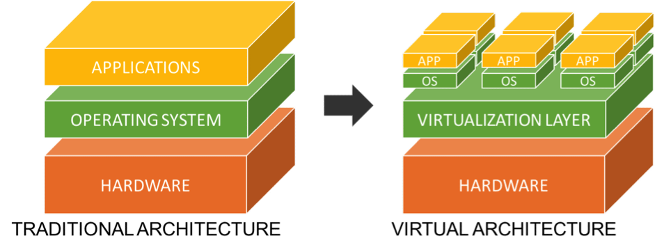

# 🐳 Learn Docker — Simple and Practical Guide

Docker helps developers run applications easily inside containers.  
It makes sure the app runs the same way on every computer — no more “works on my machine” problems!

---

## 📘 What Is Docker?

Docker is an open source standalone application which works as an engine used to run containerized applications. It is installed on your operating system, preferably on Linux, but can be also installed on Windows and macOS.

- An application running in a container is isolated from the rest of the system and from other containers, but gives the illusion of running in its own OS instance.

- Multiple Docker containers can be run on the single operating system simultaneously, you can manage those containers with Docker.

- Docker applications run in containers that can be used on any system: a laptop, on premises, or in the cloud.

- Simply we can say Docker is a container management service.


## 📚 What Is a Docker Architecture?

Docker architecture consists of:
- Image
- Container
- Registry
- Client
- Daemon


## 🧱 What Is a Image?

A Docker **image** is a lightweight, standalone, `read-only` template, and executable package that includes everything needed to run a piece of software — such as the code, runtime, libraries, environment variables, and configuration files.

You can think of an image as a `blueprint` or `template` for creating containers.

When you run an image, Docker uses it to create a container — an isolated environment where your application runs.

You can build, pull, or push images using Docker commands.

🧩 Example: `php:8.2-apache`, `mysql:8`, `redis:alpine`

## 📦 What Is a Container?

A **container** is a standard unit of software that packages up code and all its dependencies so the application runs quickly and reliably from one computing environment to another.

A container is a running `instance` of an image.

It’s created from an image, but it’s isolated and can be started, stopped, or deleted anytime.

Multiple containers can be created from the same image.

It is a lightweight, standalone, isolated, executable package of software that includes everything needed to run an application: code, runtime, system tools, system libraries, and settings.

It makes your app portable and consistent everywhere.

✅ **Think of it like:**
> A small box that has your app + all its tools **dependecies & libraries** inside.

### Example:
If your app needs **PHP 8.2** and **MySQL**, you can put them inside containers.  
Then, you can run them on any computer that has Docker — no setup problems.

- Containerization has been around for a long time, but it was introduced in a different way by Docker.

## 🐳 What Is Registry?

A registry is where Docker images are stored and shared.

The main public registry is **Docker Hub**, but you can also host private registries.

When you run docker pull, Docker downloads the image from the registry.

🧩 Example: `docker pull redis` pulls the Redis image from Docker Hub.

## 💻 What Is Client?

The client is the **command-line tool** you use to interact with Docker.

It is used to run commands like `docker run`, `docker build`, `docker push`, and `docker pull`.

The client send commands to the Docker Daemon `dockerd`.

The Docker commands use the `Docker API` to interact with the Docker Daemon.

## ⚙️ What Is Docker Daemon (`dockerd`)?

The Docker Daemon `listens` for docker API requests and manage containers, images, networks and volumes.

## 📦 What Is Namespace?

Docker use techniques called **namespaces** to **isolate** containers from each other.

When you run a container, it runs in a **new namespace** that has a unique name.

Each aspect of a container runs in a separate namespace and it's isolated from other containers.

## 💻 What Is Virtualization?

**Virtualization** lets you run **multiple operating systems** on a single physical computer.

It uses something called a **Hypervisor** to split your computer’s resources (CPU, RAM, storage) into **virtual machines (VMs)**.

Each virtual machine works like a **complete computer** with its **own operating system**.

### Example:
You can run:
- Windows as your main system
- Linux and macOS as virtual machines at the same time

Each VM thinks it’s a real computer.



## ⚙️ What Is a Hypervisor?

A **Hypervisor** is the layer of software that creates and manages virtual machines.  
It sits between the **hardware** and the **virtual machines**.

### Two Main Types of Hypervisors

| Type | Description | Examples |
|------|--------------|-----------|
| **Type 1 (Bare Metal)** | Runs directly on the physical hardware. Common in servers. | VMware ESXi, Microsoft Hyper-V, Xen |
| **Type 2 (Hosted)** | Runs on top of an existing operating system. Common for personal use. | VirtualBox, VMware Workstation |


## 🔄 Containers vs Virtual Machines

Both **containerization** and **virtualization** are technologies that allow running multiple applications on a single physical machine, but they work in different ways.


| Feature             | Containerization                                                                                              | Virtualization                                                                                                   |
| ------------------- | ------------------------------------------------------------------------------------------------------------- | ---------------------------------------------------------------------------------------------------------------- |
| **Definition**      | Packages applications and their dependencies into **containers** that share the host operating system kernel. | Uses a **hypervisor** to create and run multiple **virtual machines (VMs)**, each with its own operating system. |
| **System Overhead** | Very low — containers share the OS kernel and use fewer system resources.                                     | High — each VM needs its own full OS, consuming more CPU and memory.                                             |
| **Startup Time**    | Starts in **seconds**.                                                                                        | Takes **minutes** to boot.                                                                                       |
| **Isolation Level** | Process-level isolation (shares OS kernel).                                                                   | Hardware-level isolation (each VM has its own OS).                                                               |
| **Performance**     | High — runs almost like native performance.                                                                   | Lower — due to OS virtualization overhead.                                                                       |
| **Portability**     | Highly portable — can run on any system with Docker or container runtime.                                     | Less portable — depends on the hypervisor and OS.                                                                |
| **Lightweight**     | ✅ Yes, very lightweight.                                                                                      | ❌ No, each VM is heavy because it includes a full OS.                                                            |
| **Examples**        | Docker, Podman, LXC, RKT, CoreOS                                                                                           | VMware, VirtualBox, Hyper-V                                                                                      |


---

## 🧩 Installation Check

After installing Docker, check if it works:

```bash
docker --version OR docker -v
docker compose version
```

If you get something like this:

```
Docker version 20.10.17, build 100c701
```

Then, Docker is installed correctly.

If you get something like this:

```
docker: command not found
```

Then, Docker is not installed.