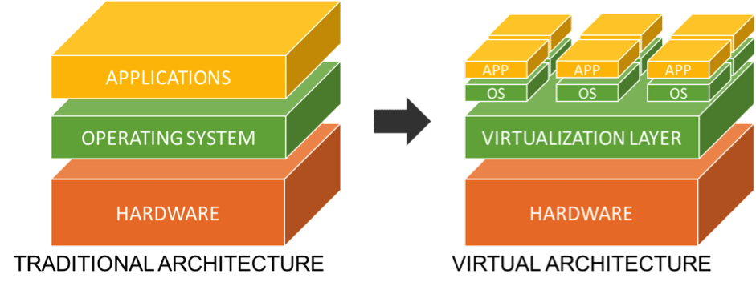
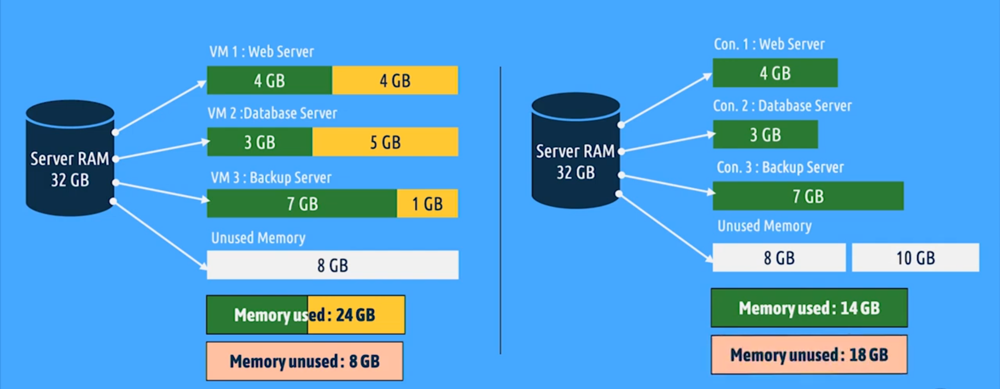

# 💻 What Is Virtualization?

**Virtualization** lets you run **multiple operating systems** on a single physical computer.

It uses something called a **Hypervisor** to split your computer’s resources (CPU, RAM, storage) into **virtual machines (VMs)**.

Each virtual machine works like a **complete computer** with its **own operating system**.

### Example:
You can run:
- Windows as your main system
- Linux and macOS as virtual machines at the same time

Each VM thinks it’s a real computer.

## ⚙️ What Is a Hypervisor?

A **Hypervisor** is the layer of software that creates and manages virtual machines.  
It sits between the **hardware** and the **virtual machines**.

### Two Main Types of Hypervisors

| Type | Description | Examples |
|------|--------------|-----------|
| **Type 1 (Bare Metal)** | Runs directly on the physical hardware. Common in servers. | VMware ESXi, Microsoft Hyper-V, Xen |
| **Type 2 (Hosted)** | Runs on top of an existing operating system. Common for personal use. | VirtualBox, VMware Workstation |

## 🔄 Containers vs Virtual Machines

Both **containerization** and **virtualization** are technologies that allow running multiple applications on a single physical machine, but they work in different ways.

| Feature             | Containerization                                                                                              | Virtualization                                                                                                   |
| ------------------- | ------------------------------------------------------------------------------------------------------------- | ---------------------------------------------------------------------------------------------------------------- |
| **Definition**      | Packages applications and their dependencies into **containers** that share the host operating system kernel. | Uses a **hypervisor** to create and run multiple **virtual machines (VMs)**, each with its own operating system. |
| **System Overhead** | Very low — containers share the OS kernel and use fewer system resources.                                     | High — each VM needs its own full OS, consuming more CPU and memory.                                             |
| **Startup Time**    | Starts in **seconds**.                                                                                        | Takes **minutes** to boot.                                                                                       |
| **Isolation Level** | Process-level isolation (shares OS kernel).                                                                   | Hardware-level isolation (each VM has its own OS).                                                               |
| **Performance**     | High — runs almost like native performance.                                                                   | Lower — due to OS virtualization overhead.                                                                       |
| **Portability**     | Highly portable — can run on any system with Docker or container runtime.                                     | Less portable — depends on the hypervisor and OS.                                                                |
| **Lightweight**     | ✅ Yes, very lightweight.                                                                                      | ❌ No, each VM is heavy because it includes a full OS.                                                            |
| **Examples**        | Docker, Podman, LXC, RKT, CoreOS                                                                                           | VMware, VirtualBox, Hyper-V                                                                                      |

